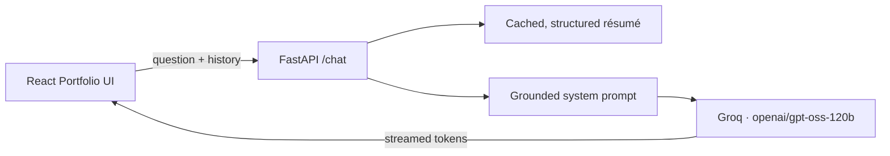

# HireMeAI

**An interactive macOS-style developer portfolio with a resume-grounded AI recruiter assistant.**

Instead of a scrolling résumé page, the portfolio is presented as a desktop environment — a dock, draggable application windows, a menu bar, and a Control Center. Projects live in Finder, skills live in Terminal, and a chat assistant sits in the dock ready to answer recruiter questions using only what's actually in the candidate's résumé.

`React 19` · `GSAP` · `Zustand` · `FastAPI` · `Groq` · `openai/gpt-oss-120b`

---

## Overview

HireMeAI pairs two things:

1. **An interactive, macOS-inspired portfolio UI** — draggable windows, a functional dock and Control Center, and dedicated windows for Projects, Résumé, Mail, GitHub, LinkedIn, and Terminal.
2. **A grounded AI assistant** that recruiters can interrogate directly. The backend parses the candidate's résumé PDF into structured, validated data and uses it as the sole source of truth for every chatbot response — the model is explicitly instructed never to infer or invent information that isn't present in the résumé.



---

## How the assistant stays honest

This is the core design problem the backend solves: a chatbot that speaks on a candidate's behalf must not exaggerate or fabricate their experience. Several deliberate choices address that.

**Structured extraction, not raw text.** The résumé PDF is parsed once with `pypdf`, then passed to an LLM call that converts it into a strict, schema-validated `Resume` object (Pydantic) — name, skills, work experience, internships, education, projects, and certifications. The result is cached in memory so the PDF is only ever processed once per backend run, not on every chat message.

**An explicit non-invention policy.** The system prompt enumerates exactly what the model may never fabricate — companies, titles, dates, degrees, technologies, metrics, certifications — and gives it a fixed fallback for gaps in the data: a short, direct statement that the résumé doesn't cover that. The assistant is instructed to state this plainly rather than hedge.

**Recruiter-appropriate brevity.** Responses are constrained to roughly one to two sentences (about 60 words) by default, with no restating of the question and no padding with every matching skill when one or two suffice. Longer, structured answers are only produced when explicitly requested.

**Conversational memory.** The most recent turns of the conversation (up to 12 messages) are included with every request, so follow-up questions resolve correctly against what was already discussed.

**Streaming delivery.** Responses are streamed token-by-token from Groq through a FastAPI `StreamingResponse`, and the frontend reveals them progressively for a more natural, real-time feel.

---

## The desktop environment

The window system is implemented as a small, genuine state machine rather than static layout:

- **`useWindowStore`** (Zustand + Immer) is the single source of truth for every window's open/closed state, z-index, and associated data. Bringing a window to the front is simply a matter of assigning it the next highest z-index.
- **`WindowWrapper`**, a higher-order component, turns any component into a draggable, animated window. GSAP handles the open/close transition, and dragging is scoped specifically to the window's header — so interactive content inside a window (inputs, scrollable panes, a PDF viewer) remains fully usable.
- **Control Center** implements real functionality rather than a static mockup: genuine fullscreen toggling, a working dark/light mode, and a brightness control.

---

## Tech stack

**Frontend**
| Technology | Purpose |
|---|---|
| React 19 + Vite | UI framework and build tooling |
| Tailwind CSS 4 | Styling |
| GSAP + `@gsap/react` + Draggable | Window animation and dragging |
| Zustand + Immer | Window manager state |
| React Markdown | Chat response rendering |
| React PDF | Résumé viewer |
| Lucide React, Day.js, clsx | Icons, dates, conditional classnames |

**Backend**
| Technology | Purpose |
|---|---|
| FastAPI + Uvicorn | REST API and ASGI server |
| Groq (`openai/gpt-oss-120b`) | LLM inference |
| Pydantic | Résumé schema validation |
| pypdf | Résumé PDF text extraction |
| uv | Python environment and dependency management |

---

## Project structure

```
stalk-me/
├── backend/
│   └── hiremeai/
│       ├── main.py          # FastAPI app: résumé parsing + chat streaming
│       ├── my_resume.pdf    # source of truth for the assistant
│       └── pyproject.toml
└── frontend/
    └── src/
        ├── components/      # Navbar, Dock, ControlCenter, Welcome, WindowControls
        ├── windows/         # Finder, Resume, Terminal, Mail, GitHub, LinkedIn,
        │                     Safari, Text, Image, Chatbot
        ├── hoc/WindowWrapper.jsx   # HOC that turns a component into an OS window
        ├── store/Window.jsx        # Zustand window-manager store
        └── constants/index.js      # dock apps, nav links, window config
```

---

## Getting started

### Prerequisites

- Node.js and npm
- Python 3.14+ and [uv](https://docs.astral.sh/uv/)
- A Groq API key

### Backend

```bash
cd backend/hiremeai
uv sync
echo "GROQ_API_KEY=your_groq_api_key" > .env
uv run uvicorn main:app --reload
```

The API is available at `http://127.0.0.1:8000`, with interactive documentation at `/docs`.

### Frontend

```bash
cd frontend
npm install
echo "VITE_API_URL=http://localhost:8000" > .env
npm run dev
```

The portfolio runs at `http://localhost:5173`. If `VITE_API_URL` isn't set, the frontend defaults to `http://localhost:8000`.

---

## API reference

| Endpoint | Description |
|---|---|
| `GET /` | Health check — returns `{"message": "HireMeAI is running!"}` |
| `GET /resume` | Returns the parsed, structured résumé as JSON |
| `POST /chat` | Accepts `{question, history}`; returns a streamed plain-text response |

---

## Current limitations

- Supports a single candidate/résumé; no multi-profile support
- The parsed résumé is cached in memory and re-parsed on backend restart
- Conversation memory is limited to the most recent turns, not persisted
- The desktop layout targets desktop/tablet screens; mobile support is limited
- Requires an active Groq API connection

## Future improvements

- [ ] Job description matching with a candidate fit score
- [ ] Résumé upload from the UI
- [ ] Persistent, per-recruiter conversation sessions
- [ ] Database-backed candidate profiles
- [ ] Improved mobile layout for the window manager
- [ ] Authentication and production-grade logging/monitoring

---

## License

Intended for personal/portfolio use. Add a specific open-source license if distributing publicly.